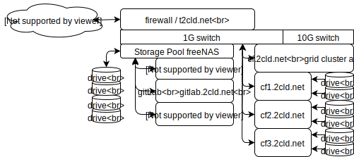

# Infrastructure

Goal: Looseleaf cloud render using a blender grid config, test, monitoring and preformance study.

## Task

| Task            | Goal | Status  |
| --------------- | ------------------------------------------------------ | -------- |
| blender cluster | Remote access by User [lls-blender-grid Setup]() document. | needs doc |
| deploy Test     | One button deploy and validate [lls-lls-blender-grid-test]() document. | no progress |
| load Test     | One button load test [lls-lls-blender-grid-load]() document. | no progress |
| node add | Test node add | no progress |
| node fail | Test node fail | no progress |

## Infrastructure Diagram

Source edit [lls-blender-grid-diagram.drawio](https://www.draw.io/#Hlooseleaf%2Flls-nodejs-test%2Fmaster%2Fdocs%2Fimages%2Flls-infrastructure-diagram.drawio)

### Server H/W

| Device | Description | Link |
| ----------- | ---------------- | --------- |
| FreeNAS HB  | CPU HB           | [cpu Xeon E3-1230](https://ark.intel.com/content/www/us/en/ark/products/97474/intel-xeon-processor-e3-1230-v6-8m-cache-3-50-ghz.html) |
| FreeNAS HB  | CPU CF           | [cpu Xeon E5462](https://ark.intel.com/content/www/us/en/ark/products/33084/intel-xeon-processor-e5462-12m-cache-2-80-ghz-1600-mhz-fsb.html) |

### Notes

- [Docker Blender Render Cluster](https://github.com/rndevfx/docker-blender-render-cluster)

[markdown cheat sheet](http://blog.christrees.com/wip/markdowntest.html)
